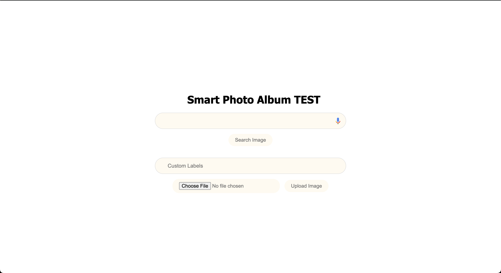
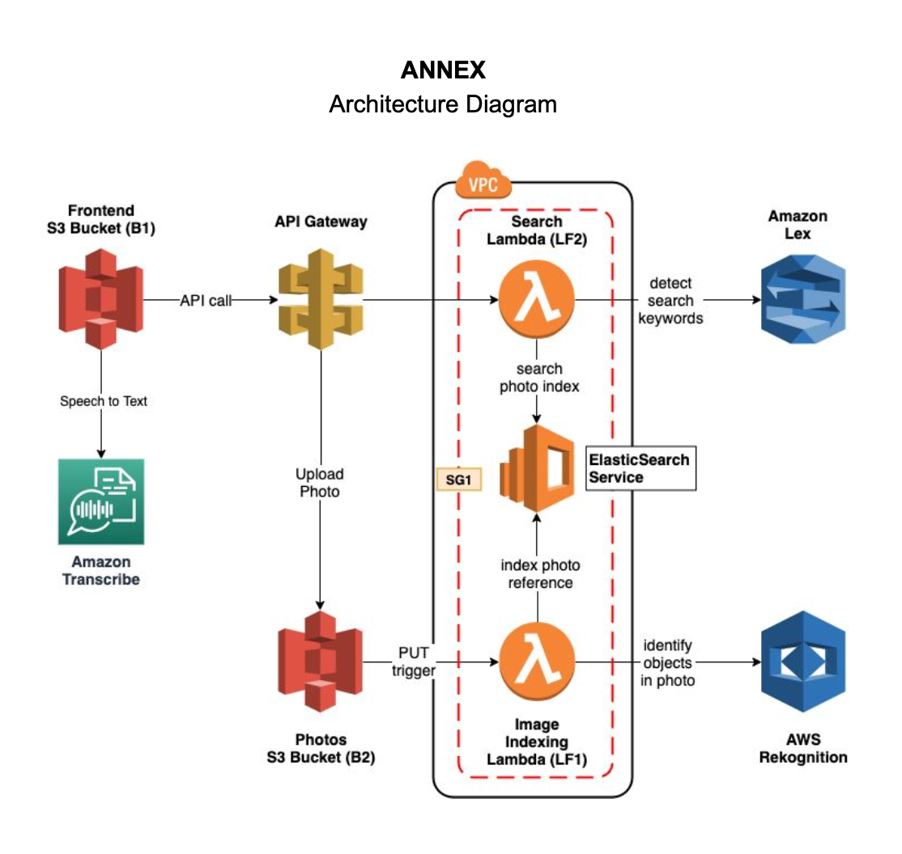

# Smart Photo Album
Cloud Application for Smart Photo Album

### Demo

### Description
Implement a photo album web application, that can be searched using natural language through both text and voice. We will be using Lex, ElasticSearch, and Rekognition to create an intelligent search layer to query your photos for people, objects, actions, landmarks and more.

Example Interaction for this Smart Photo Album is 
1. Visit your photo Album Application using the S3 hosted URL.
2. Search photos using Natural Language via voice and text.
3. See relevant results(ex.If you searched for a cat,you should be able to see photos with cats in them) based on what you searched.
4. Upload new photos(with or without custom labels) and see the mappear in the search results.

### Architecture Diagram

### Build and deploy

npm run build compile typescript to js
npm run watch watch for changes and compile
npm run test perform the jest unit tests
cdk deploy deploy this stack to your default AWS account/region
cdk diff compare deployed stack with current state
cdk synth emits the synthesized CloudFormation template
